# Banmill

Banmill es una propuesta de un banco 100% digital, permitiendo al usuario realizar las mismas operaciones que realiza en un banco presencial, mediante un proceso menos complicado y más agradable

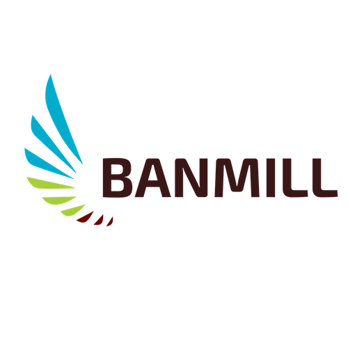

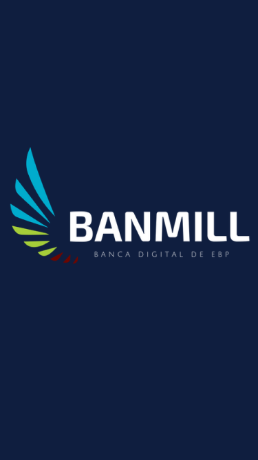

# Desarrollado para:

[Laboratoria](http://www.laboratoria.la/)

# Detalles del Proyecto:

* **TRACK:** *ESPECIALIZACIÓN UX-DESIGNER*
* **CURSO:** *CONOCIENDO LOS NEGOCIOS*
* **UNIDAD 1:** *LECCIONES BÁSICAS DE NEGOCIOS*

# Equipo de trabajo:

* Maria Teresa Ruíz Quispe.
* Darcy Isabel Cervera Huamaní.

# Descripción del reto:

El Banco del País es uno de los bancos más importante de tu país. Es una institución de muchos años y actualmente está pasando por un proceso de transformación digital. Como parte de este proceso, han implementado un área de innovación que quiere llegar de una mejor manera a los usuarios más jóvenes. Por lo que, inspirados en [Nequi](https://www.nequi.com.co/), [Nubank](https://www.nubank.com.br/) y [Simple](https://www.simple.com/) se han propuesto crear un banco 100% digital dirigido para millenials.

# Objetivo:

* Identificar los stakeholders del proyecto
* Planear una reunión kick - off
* Identificar hábitos financieros y preferencias en plataformas digitales de la generación millenial.

# Etapa Previa:

## A. Recolección de Información Previa (Fuente Latinia)

   "Los Millennials supondrán el 75% de la fuerza laboral en el mundo"

   "El 40% de los millennials nunca han pisado una sucursal bancaria y la mayoría no está familiarizada con la misma"

   "El 53% no piensa que su banco sea diferente al de los demás"

   "No piensan en pensionarse y prefieren usar el dinero para viajar en lugar de ahorrar"

## B. Nuestros  Stakeholders

   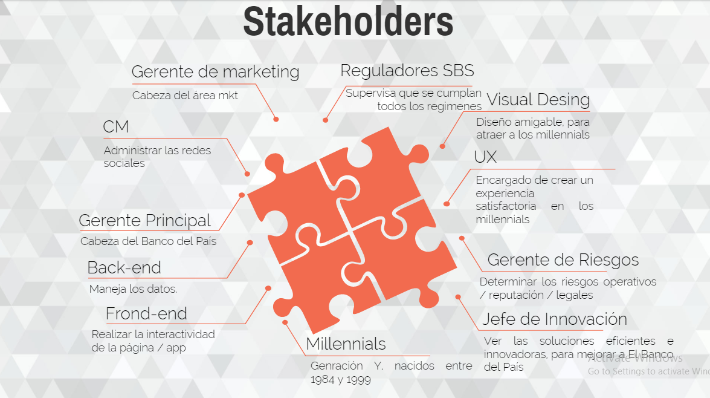

## C. Reunión Kick-Off

   * Preguntas Cliente Interno:

     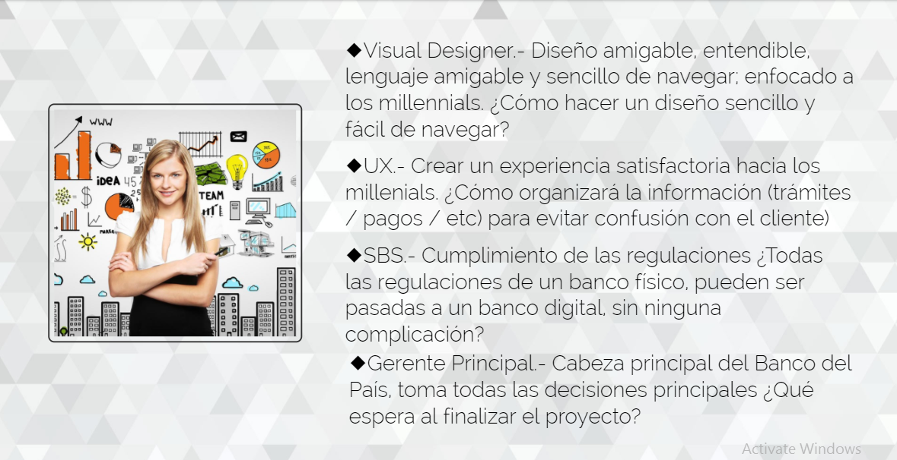

   * Business Model Canvas:

     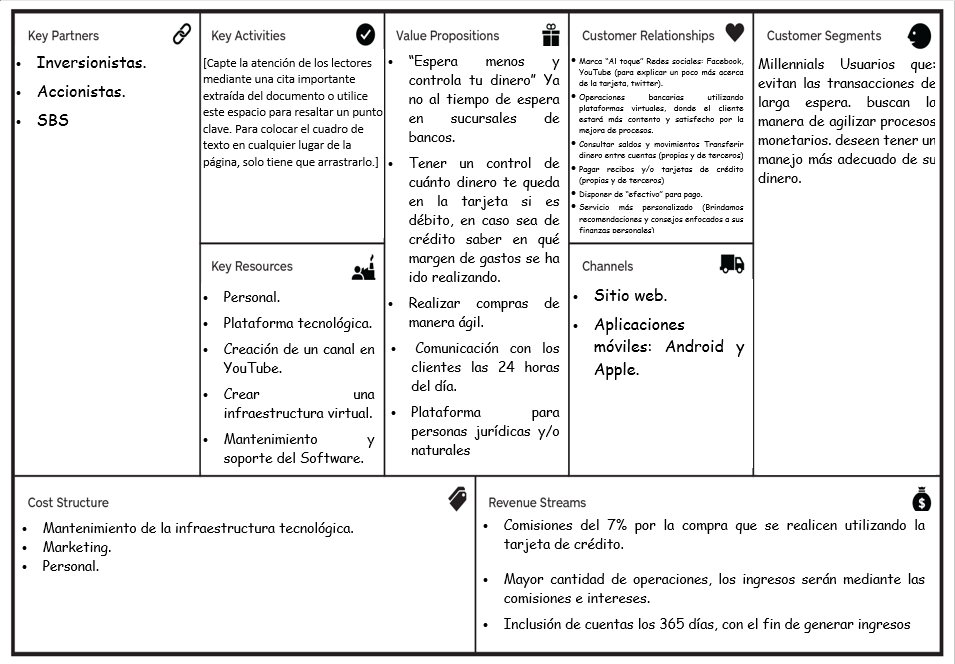

   * Objetivo de BANMILL:

     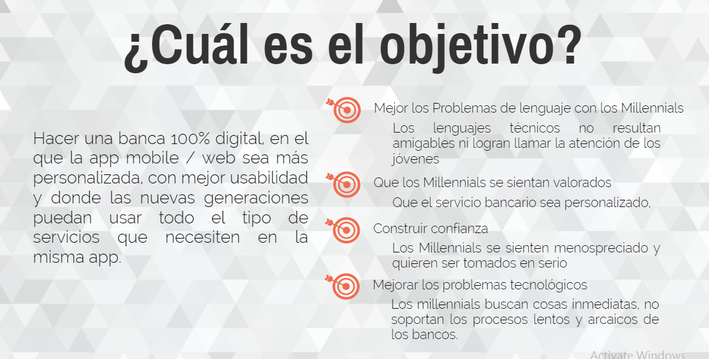

   * Beneficios que ofrece BANMILL para El Banco del País:

     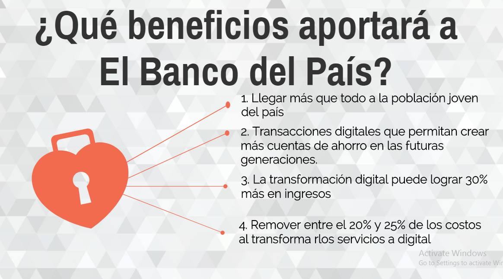  

   * Alcance:

     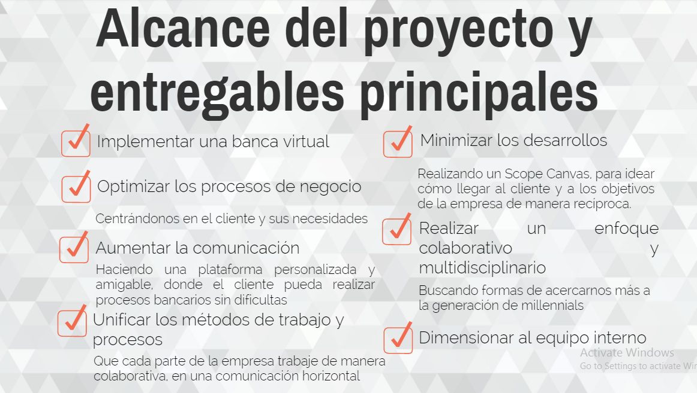

   * Principales Riesgos:

     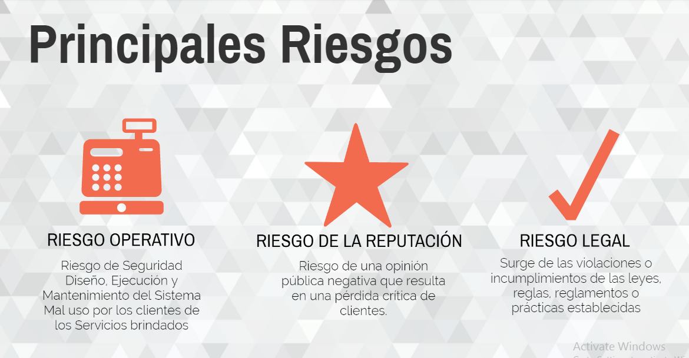

## D. Plan de Investigación

   * Objetivos:

     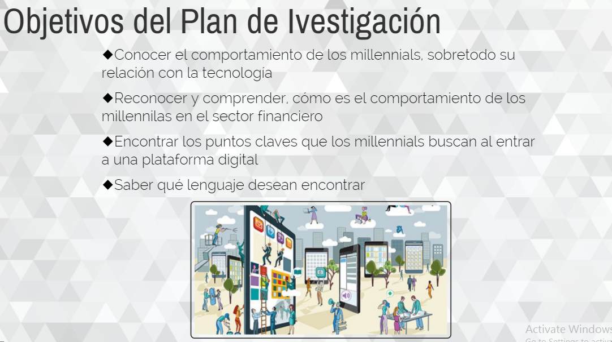

   * Herramientas a utilizar:

     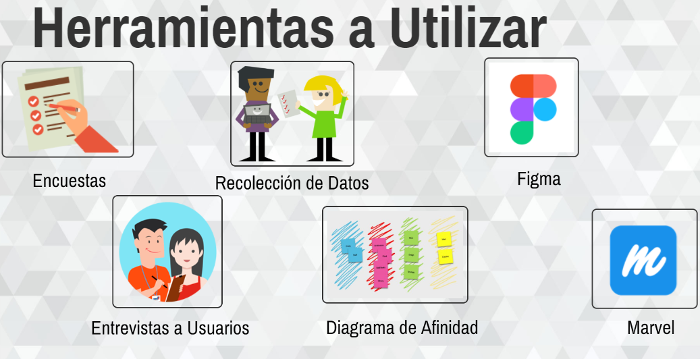

   * Actividades a Realizar:

     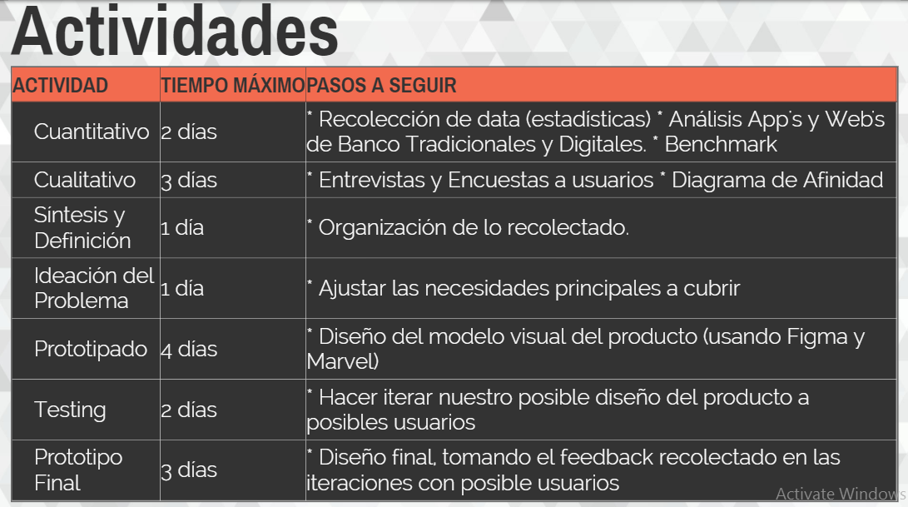

     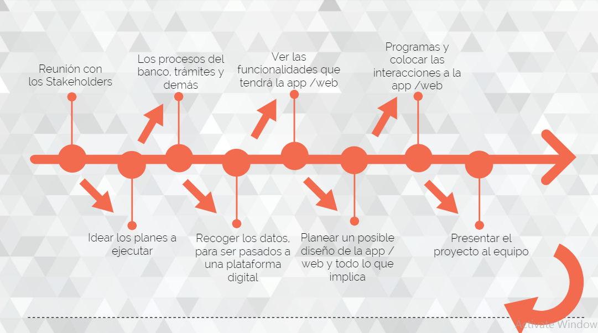

# Etapas DCU (Diseño Centrado en el Usuario):

## A. Descubrimiento e Investigación

Actividades:

1. Formulación de las preguntas para la entrevista y encuesta online:

    * Se trabajó de manera individual en el planteamiento de las preguntas, luego se definió y unificó el trabajo para obtener las preguntas que nos permitirán alcanzar el objetivo identificado.

        [Preguntas de la encuesta online](https://darcy43.typeform.com/to/SUCvYy)

2. Entrevista con usuarios:

3. Recolección de datos de la Encuesta a través de Typeform:

## B. Síntesis y Definición

Actividades:

1. Definición del problema: Diagrama de afinidad

El procedimiento que se siguió a través del diagrama de afinidad fué:

* Paso 1: Colocar en post-its los comentarios negativos o problemas que tienen los usuarios al recurrir en un banco.

* Paso 2: Agrupar los post-its por afinidad en temas específicos, los cuales fueron:

    * Atención.
    * Tiempo.
    * Cobros.
    * Otros.

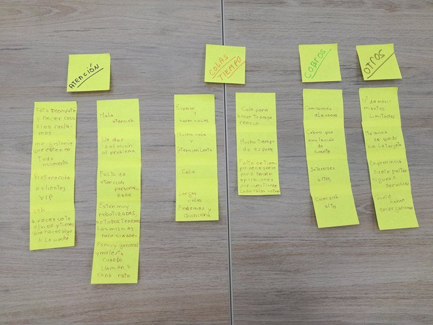

### 3. Elección del problema

El problema que se identificó fue: La necesidad de contar con una atención amigable y empática en todo momento y el tiempo de espera para poder realizar operaciones bancarias.

Es posible que la información otorgada por los bancos no sea recibida en este caso millenials, de la forma en que se espera, esperando ellos que el banco pueda absolver sus dudas al momento, considerando también que las operaciones bancarias que en general se hacen de manera presencial, resulta complicado pues es mucho el tiempo de espera para poder realizar alguna operación, en especial fin de mes y quincena.

### 4. Definición del User persona:

## C. Prototipado

### Actividades:

### 1. Realización del Prototipo

* Se utilizó Figma para el desarrollo del flujo de diseño y Marvel como herramiento de prototipado.

    * Prototipo cuando se crea cuenta por primera vez: [Ver prototipo](https://marvelapp.com/c52a8a9)

    * Prototipo cuando cuenta con una cuenta en Banmill:

## D. Testing

### Actividades:

**Testing 01**

## Presentación Final del Prototipo:

* Prototipo cuando se crea por primera vez una cuenta en Banmill:
[Ver prototipo](https://marvelapp.com/c52a8a9)

* Prototipo cuando ya tiene una cuenta registrada en Banmill:
[Ver prototipo]()
